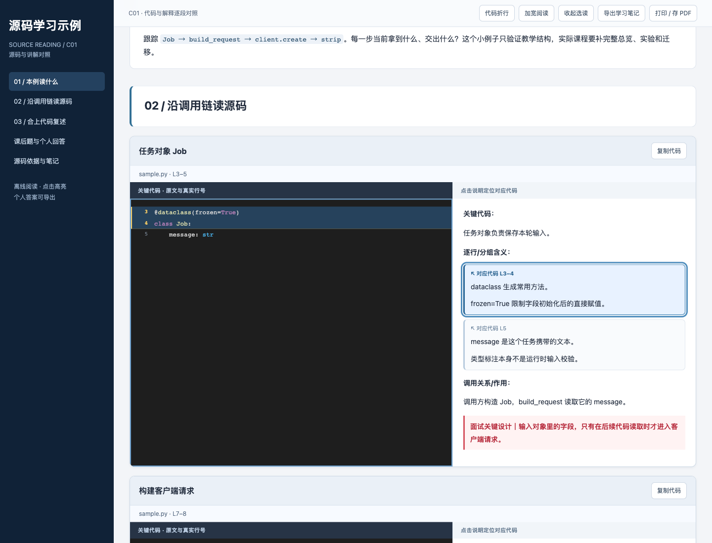

# learning-code

**Turn project source code into a Chinese course you can navigate, annotate, and practice.**

[简体中文](README.md) · English

`learning-code` is a source-code teaching skill that can be installed in Codex and Claude Code. It guides the assistant through a project's actual call chain, then produces a self-contained HTML lesson with code on the left and explanations on the right. Clicking an explanation highlights its source lines and scrolls them into view.

Use it to learn an unfamiliar project, study a framework one lesson at a time, or prepare for implementation-level interview questions. Lessons are Chinese by default; this English introduction does not imply a fully translated English lesson interface.



The screenshot uses the repository's synthetic example to show explanation-to-source highlighting.

## What it provides

- **Lessons built around a call chain:** an overview, guiding questions, prerequisites, success and failure paths, small experiments, and ideas for applying the concepts elsewhere.
- **Explanations tied to source:** each card follows “key code → line or group meaning → calls and purpose.” Explanations appear as separate paragraphs with individual source mappings. Key design decisions use bold red emphasis.
- **Actual source excerpts:** indentation and line numbers are preserved; copying returns source code without display line numbers. Python uses token-based coloring, while JS, TS, JSON, and Vue use lightweight lexical coloring—not full IDE semantic highlighting.
- **A manageable lesson:** the default is 3–5 hours, with 180 minutes of core work and up to 120 minutes of optional study. Long functions can span cards, and secondary branches can be folded.
- **Source-aware practice:** ten questions without answers by default, prioritizing supplied interview material and labeling each as original, adapted, or new.
- **Reading tools:** keyboard navigation, source copying, notes, and answer export. Notes use browser storage; export important work as a backup.

The renderer extracts, validates, and formats content. The assistant still needs to read the project and author the explanations, question selection, and design analysis. Running the script alone does not teach or summarize an entire repository.

## Installation

HTML generation requires **Python 3.9+** and uses only the standard library. Optional browser checks additionally require Node.js, Playwright, and an available Chromium or Edge browser. The repository does not install those dependencies automatically.

Choose the directory for your tool. If `learning-code` is already installed there, inspect the existing version and local changes before merging updates. Do not overwrite it blindly.

### Codex

Clone into Codex's personal skill directory:

```bash
mkdir -p ~/.codex/skills
git clone https://github.com/ddherm/learning-code.git ~/.codex/skills/learning-code
```

Reload skills in your Codex session, then invoke it with `$learning-code`.

### Claude Code

Clone the same repository into Claude Code's personal skill directory to make it available across projects on this machine. See the [official skills documentation](https://code.claude.com/docs/en/skills#choose-where-skills-load).

```bash
mkdir -p ~/.claude/skills
git clone https://github.com/ddherm/learning-code.git ~/.claude/skills/learning-code
```

Start Claude Code in your project directory, then enter:

```text
/learning-code Create the first Chinese HTML lesson following this project's tutorial.md.
```

Both tools use the same `SKILL.md`, reference documents, and scripts. Allow the assistant to read project files and run the relevant commands. Compatibility with Claude Code's skill format and the scripts' dependencies has been reviewed; generating a complete lesson within Claude Code has not yet been tested.

## Use the skill

In a Codex or Claude Code session with access to your project, provide the project path, syllabus, and lesson number.

In the example below, `interview.md` is a collection of interview material related to your project. It can contain questions asked in past interviews, interview notes, and topics you may be asked about when discussing the project. The skill prioritizes questions from this material that are relevant to the current lesson.

`interview.md` is only an example filename; replace it with the path to your own material. If no suitable interview material is available, the skill generates questions from the lesson's source code and labels them as “New.”

The examples below use Codex's invocation syntax. In Claude Code, replace the opening `Use $learning-code to ` with `/learning-code ` and keep the remaining lesson requirements.

```text
Use $learning-code to create the Chinese HTML document for lesson 2,
following this project's tutorial.md.
Keep it within 3–5 hours and cover the complete call chain and failure branches.
Use side-by-side code explanations; clicking each explanation must highlight
the corresponding code.
Choose ten practice questions from interview.md where relevant, cite their
sources, and omit answers. Include a small experiment, transfer ideas,
and a self-check list.
```

Without a syllabus, start with a specific entry point or topic:

```text
Use $learning-code to plan the first Chinese lesson around this project's
HTTP request entry point. Follow validation, service calls, and the response.
Explain prerequisites and where the next lesson begins.
```

The default lesson package includes `lesson.html`, an editable `lesson.json`, text output, questions, a source index, and a short verification record. The renderer itself writes the four files below; the course author maintains the other materials.

| File | Purpose |
| --- | --- |
| `lesson.html` | Self-contained interactive lesson for offline reading |
| `lesson.md` | Searchable text version for review and editing |
| `questions.md` | Practice questions with source notes |
| `source-index.json` | Source ranges, hashes, and question provenance |

## Try the synthetic example

From the repository root, run:

```bash
python3 scripts/render_lesson.py \
  --spec assets/example/lesson.json \
  --root assets/example \
  --out /tmp/learning-code-example
```

Open `/tmp/learning-code-example/lesson.html` in a browser. No model, API key, or real project is needed. The example contains three source cards and three questions to demonstrate the format and interactions; it is not a complete three-hour lesson.

For a real course, read the [teaching guidelines](references/pedagogy.md) and [data format](references/lesson-format.md), then use the example JSON as a structural reference. Author and review your teaching content, using paths relative to the project root. The skill and reference documents are currently in Chinese.

```bash
python3 scripts/render_lesson.py \
  --spec /path/to/lesson.json \
  --root /path/to/project \
  --out /path/to/course
```

Add `--check` to validate without writing files. The renderer refuses to overwrite changed generated files. First merge any edits you want to keep into `lesson.json`, then use `--replace`; changed output files are backed up before replacement.

## Verification

Run the renderer's self-tests:

```bash
python3 scripts/self_test.py
```

These use synthetic inputs to check source and indentation fidelity, line mappings, question counts and provenance, the default exclusion of answers, complete symbol coverage, and protection against overwriting inputs. Static checks do not establish that a lesson's explanations are correct.

If Playwright and its Chromium are already available, check the generated example in a browser:

```bash
node scripts/check_browser.cjs \
  --html /tmp/learning-code-example/lesson.html \
  --root assets/example \
  --out /tmp/learning-code-browser-check
```

Use `--browser /path/to/browser` for an existing Chromium or Edge executable. If Node cannot resolve your installed Playwright, set `PLAYWRIGHT_MODULE=/path/to/playwright`. Checks cover source matching, individual highlights, keyboard input, copying, notes and export, and desktop and narrow layouts. The script produces a report and screenshots; screenshots still need visual review. See the [verification guide](references/verification.md).

## Repository layout

```text
SKILL.md                  Skill entry point and workflow
agents/openai.yaml        Codex display configuration
references/               Teaching, questions, format, verification, and routing
scripts/render_lesson.py  HTML and text renderer
scripts/self_test.py      Renderer self-tests
scripts/check_browser.cjs Browser interaction checks
assets/lesson.css         Lesson styling
assets/lesson.js          Navigation, notes, and export
assets/example/           Synthetic source, interview material, and lesson spec
evals/evals.json          Skill behavior evaluation scenarios
```

## Optional companion skills

`project-guide` can help organize the syllabus and establish call chains. `interview` can continue with mock interviews when requested. Browser, PDF, Word, and visualization skills can handle their respective tasks. They are not bundled here or required by the renderer; select them only when available and relevant. See [skill routing](references/skill-routing.md).

The HTML renderer does not call a model, start a service, or modify production source. The assistant authoring a course and its hosting platform process supplied material under their own mechanisms. Generated lessons contain source excerpts and interview material, so review content and sharing permissions before publishing them. Creating a lesson does not publish it to an external website by default.
